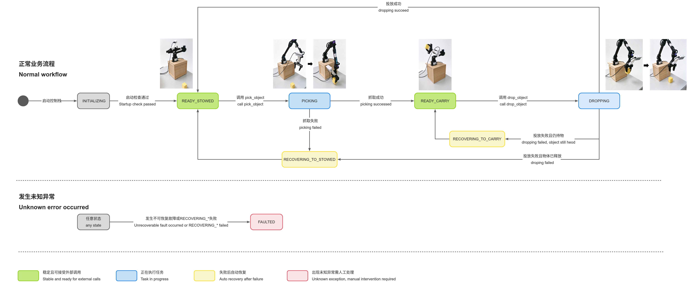

# D1 Manipulation API Reference

[简体中文](README_CN.md) | English

This document is intended for clients of the arm manipulation module. It describes the public interfaces, how to send requests, what the request and response fields mean, and how to use the results to decide what to do next.

## 1. Overall Workflow
<!-- Workflow diagram -->
  


On startup, the module enters `INITIALIZING`. Once joint feedback, the standard pose, and the planning scene have been checked, it enters `READY_STOWED`: the arm is in its stowed (STOWED) pose and can accept a pick task. Calling `pick_object` transitions the arm to `PICKING`. A successful pick ends in `READY_CARRY`, meaning the arm has reached its carry (CARRY) pose and passed the grip-retention check, confirming that it holds an object and can accept a drop task. Calling `drop_object` transitions the arm to `DROPPING`. After a successful drop, the object has been released and the arm has returned to `READY_STOWED`, ready for the next task.

If a recoverable task-level failure occurs during picking—for example, no object is detected, the grasp pose is unreachable, or no collision-free trajectory can be found—the arm attempts to return to its stowed pose via `RECOVERING_TO_STOWED`. If a drop task carrying an object fails before release, the arm attempts to retain the object and return to its carry pose via `RECOVERING_TO_CARRY`. If recovery fails, or an execution, communication, or state fault cannot be recovered automatically, the system enters `FAULTED`. The client should then stop automatic tasks and arrange for manual troubleshooting. State values, permitted operations, and complete transition conditions are listed later in this document.

<font style="color:#df2a3f;">Note: This module is not a general-purpose grasping solution and does not currently support objects of arbitrary shapes. It supports only three target categories: yellow cubes, elongated green objects (such as zucchini), and bowls. For object details, see: </font>[Objects Used as Trash](objects/README.md)

## 2. Interface Overview
The arm manipulation module exposes two ROS 2 Actions and one status Topic. To initiate a pick or drop task, the client only needs to supply the approximate object location or the drop target location. It does not need to specify the object class, grasp pose, release pose, or arm trajectory.

If a task fails, the interface also returns information to guide the client's next decision—for example, to reposition the mobile platform relative to the target so that the target can be observed and reached, then retry.

| Interface | Kind | ROS 2 Type | Purpose | When It Can Be Called | State After Success |
| --- | --- | --- | --- | --- | --- |
| `/arm/tasks/pick_object` | Action | `d1_interfaces/action/PickObject` | Identify, grasp, lift, and carry an object using its approximate location | When the arm is in `READY_STOWED` | `READY_CARRY` |
| `/arm/tasks/drop_object` | Action | `d1_interfaces/action/DropObject` | Release an object using the center of the bin's bottom as the target, then return to the stowed pose | When the arm is in `READY_CARRY` or `READY_STOWED` | `READY_STOWED` |
| `/arm/task_status` | Topic | `d1_interfaces/msg/ArmTaskStatus` | Publish the arm's current task state, payload state, execution phase, and fault information | Can be subscribed to in any state | Does not change the arm's state |


### 2.1 Goal, Feedback, and Result in ROS 2 Actions
A ROS 2 Action consists of a Goal, Feedback, and a Result. These are strongly typed ROS 2 messages, not JSON. The command-line tool uses YAML for input and display; Python and C++ use the corresponding message objects.

The Goal contains the task inputs, Feedback reports progress during execution, and the Result contains the final task outcome:

| Data | Direction | Frequency | Purpose |
| --- | --- | --- | --- |
| Goal (task request) | Client → arm | Sent once per call | The Action's input; tells the arm what task to perform |
| Feedback (execution feedback) | Arm → client | Zero or more messages during execution | Reports the current phase, estimated progress, and explanatory text; used only for progress display and diagnostics |
| Result (final result) | Arm → client | Returned once when an accepted task ends | The Action's final output; reports whether the task succeeded, the arm's final state, and what the client should do next |


The complete interaction is as follows:

```text
The client sends a Goal
    ↓
The arm executes the task and publishes Feedback
    ↓
The task ends, and the arm returns one Result
```

## 3. Before Making a Call
The following steps assume that you have completed the [deployment tutorial](../../deploy/README.md) and entered the development container. Start the arm control stack in the first terminal:

```bash
# Start the control stack with RViz
cd /workspace && ./scripts/real_bringup.zsh --rviz

# Start the control stack without RViz
cd /workspace && ./scripts/real_bringup.zsh
```

Once `D1 REAL CONTROL STACK READY` appears, leave this terminal running.

Open another terminal in the same container, load the same ROS environment, and use the same `ROS_DOMAIN_ID`. First, check that both Actions and the status Topic have been discovered:

```bash
ros2 action list | grep '^/arm/tasks/'
ros2 topic list | grep '^/arm/task_status$'
```

The output should include at least:

```latex
/arm/tasks/drop_object
/arm/tasks/pick_object
/arm/task_status
```

Then read the arm's current state:

```bash
ros2 topic echo /arm/task_status --once --qos-reliability reliable --qos-durability transient_local
```

Before starting a normal pick task, confirm `state: 1` (`READY_STOWED`) and `payload_state: 0` (`PAYLOAD_EMPTY`). These indicate that the arm service is ready.

## 4. Pick Interface: `/arm/tasks/pick_object`
### 4.1 Workflow Overview
When `pick_object` is called with an object location, the arm first points the camera toward that location for coarse observation and object recognition. Once the object is identified, the arm moves above it for fine observation and grasp-pose estimation. If the grasp pose and subsequent motion paths are feasible, the arm descends and closes the gripper, then lifts the object, returns to the carry pose, checks grip retention, and returns the task result.

At the end of the task, the `outcome` field in the final Result tells the client whether to proceed with dropping, reposition the mobile platform and retry picking, or stop automatic tasks and arrange for manual troubleshooting. The Result also reports the arm's final state and payload state.

### 4.2 Interface Details
| Item | Description |
| --- | --- |
| Action name | `/arm/tasks/pick_object` |
| Action type | `d1_interfaces/action/PickObject` |
| Required initial state | `READY_STOWED` |
| State after success | `READY_CARRY` |
| Payload state after success | `PAYLOAD_HELD` |


### 4.3 Goal Parameters
| Field | Type | Required | Values and Description |
| --- | --- | --- | --- |
| `target` | `geometry_msgs/PointStamped` | Yes | The client's estimate of the object's approximate location, used to plan observation movements and associate visual detections with the target |
| `target.header.frame_id` | `string` | Yes | The original coordinate frame in which the target data was produced; a TF from this frame to the arm's planning frame must be available |
| `target.header.stamp` | `Time` | No | Prefer the original timestamp of the target data so that TF can be queried for that time; zero explicitly requests the latest TF |
| `target.point.x/y/z` | `float64` | Yes | Target position in meters; all values must be finite |
| `stop_after` | `uint8` | Yes | Always pass `4` (`GRASP_AND_CARRY`) in production |


The complete `stop_after` enumeration is listed below. Values `0–3` are for staged debugging only and are disabled by the default production launch. In production, a Goal with any value other than `4` is rejected without moving the arm.

| Value | Enumeration | Meaning |
| --- | --- | --- |
| `0` | `COMPUTE_ONLY` | Compute only; do not execute the pick motion |
| `1` | `MOVE_PREGRASP` | Stop after reaching the pregrasp pose |
| `2` | `DESCEND` | Stop after completing the descent |
| `3` | `GRASP_AND_LIFT` | Stop after grasping and lifting |
| `4` | `GRASP_AND_CARRY` | Complete the pick and enter CARRY; always use this value in production |


### 4.4 Feedback Parameters
| Field | Type | Description |
| --- | --- | --- |
| `current_state` | `string` | The current internal pick phase, distinct from the public state in `/arm/task_status.state`; examples include `MOVE_PREGRASP`, `DESCEND`, and `CARRY` |
| `progress` | `float32` | Progress estimated from the execution phase, ranging from `0.0` to `1.0`; does not indicate remaining execution time |
| `detail` | `string` | A human-readable description of the current phase; must not be used for programmatic branching |


Feedback is only for progress display and diagnostics. A Feedback message does not establish that the task has succeeded; the client must wait for the final Result.

### 4.5 Result Parameters
| Field | Type | Values or Validity Conditions | Meaning and Client Response |
| --- | --- | --- | --- |
| `success` | `bool` | `true` / `false` | Whether the full pick sequence completed, the arm reached CARRY, and the grip-retention check passed. Useful for a quick check; programmatic decisions should use `outcome` |
| `outcome` | `uint8` | `0 OUTCOME_SUCCESS` | Pick succeeded; the client can navigate to the drop area and call `drop_object` |
|  |  | `1 OUTCOME_REPOSITION_REQUIRED` | No safe, reachable grasp is available from the current relative position. The arm is expected to have returned to `READY_STOWED / PAYLOAD_EMPTY`; reposition the mobile platform or change the viewing angle before retrying |
|  |  | `2 OUTCOME_ARM_FAULTED` | The arm has a fault that cannot be recovered automatically; stop automatic tasks and arrange for manual troubleshooting |
| `failure_category` | `uint8` | `0–5` | Technical failure category for statistics and diagnostics only; must not replace `outcome` in task-level decisions. See Appendix A for the full enumeration |
| `failed_state` | `string` | Usually empty on success | The internal phase in which failure was first established; for diagnostics only |
| `detail` | `string` | Free text | Detailed cause, recovery result, and recommendations; wording may change with implementation updates and must not be used for programmatic branching |
| `returned_to_stowed` | `bool` | `true` / `false` | Whether the arm has been confirmed to be in STOWED when the Result is returned. This is `false` after a successful pick ending in CARRY and does not indicate failure |
| `final_task_state` | `uint8` | Uses the same enumeration as `/arm/task_status.state` | The arm's task state when the Result is returned |
| `payload_state` | `uint8` | Uses the same enumeration as `/arm/task_status.payload_state` | The payload state when the Result is returned |
| `class_name` | `string` | `yellow_cube`, `zucchini`, or `bowl`; may be empty if failure occurs before recognition | The automatically identified target class |
| `estimated_center` | `geometry_msgs/PointStamped` | Valid when `success=true` | Estimated object center after fine observation or fine-tuning |
| `grasp_pose` | `geometry_msgs/PoseStamped` | Valid when `success=true` | The final selected TCP grasp pose |
| `pregrasp_pose` | `geometry_msgs/PoseStamped` | Valid when `success=true` | The final selected TCP pregrasp pose |
| `pregrasp_distance_m` | `float64` | Valid when `success=true`; meters | Pregrasp distance or ground clearance selected by the object-specific strategy |
| `grasp_distance_m` | `float64` | Valid when `success=true`; meters | Grasp depth or ground clearance selected by the object-specific strategy |
| `grasp_yaw_degrees` | `float64` | Valid when `success=true`; degrees | Final grasp yaw |
| `approach_tilt_degrees` | `float64` | Valid when `success=true`; degrees; normally `0` under the current production strategy | Final approach tilt |


Poses, distances, and recognition results should only be treated as reliable outputs when `success=true`. These fields are still returned on failure, but may contain defaults or incomplete intermediate results. An empty frame ID or an all-zero quaternion, for example, is not a valid pose. Handle failures using `outcome` and the final state; do not use these geometric fields to reconstruct and execute arm trajectories independently.

### 4.6 Goal Examples
#### Command Line
```bash
ros2 action send_goal /arm/tasks/pick_object \
  d1_interfaces/action/PickObject \
  "{target: {header: {frame_id: target_source_frame}, point: {x: 0.20, y: 0.35, z: -0.15}}, stop_after: 4}" \
  --feedback
```

Notes:

+ `--feedback` is a display option of the `ros2 action send_goal` command-line tool. It continuously prints the arm's Feedback messages in the terminal. It is not a field in the `PickObject` Goal, is not sent to the arm as a request parameter, and does not change task execution. Without it, the tool still sends the task and waits for the final Result, but does not display execution feedback. Python and C++ clients receive this information through the Action client's Feedback callback rather than a `--feedback` argument.
+ `target_source_frame` is a placeholder. Replace it with the frame in which the target data was originally produced. For example, use the camera frame for targets produced directly by a camera perception node, or `map` or `odom` for targets produced in those frames by a localization fusion module. The client should not pre-transform targets into `base_link` merely to accommodate the arm interface. As the consumer of the data, the arm module transforms the original target into its planning frame using TF.
+ The example coordinates illustrate the message format only; they are not safe grasp targets for other setups. Use estimates from your actual scene, and ensure that `frame_id`, the timestamp, and the coordinates refer to the same target data.

#### Python (`rclpy`)
The following minimal client waits for the Action Server, sends a Goal, prints each Feedback message, and reads the Result when the task ends:

```python
import rclpy
from rclpy.action import ActionClient
from rclpy.node import Node

from d1_interfaces.action import PickObject


class PickObjectClient(Node):
    def __init__(self):
        super().__init__('pick_object_client')
        self._client = ActionClient(
            self, PickObject, '/arm/tasks/pick_object')

    def feedback_callback(self, message):
        feedback = message.feedback
        self.get_logger().info(
            f'phase={feedback.current_state}, '
            f'progress={feedback.progress:.2f}, '
            f'detail={feedback.detail}')

    def execute(self):
        if not self._client.wait_for_server(timeout_sec=10.0):
            raise RuntimeError('pick_object Action Server is unavailable')

        goal = PickObject.Goal()
        goal.target.header.frame_id = 'target_source_frame'
        goal.target.header.stamp = self.get_clock().now().to_msg()
        goal.target.point.x = 0.20
        goal.target.point.y = 0.35
        goal.target.point.z = -0.15
        goal.stop_after = PickObject.Goal.GRASP_AND_CARRY

        send_future = self._client.send_goal_async(
            goal, feedback_callback=self.feedback_callback)
        rclpy.spin_until_future_complete(self, send_future)
        goal_handle = send_future.result()
        if goal_handle is None or not goal_handle.accepted:
            raise RuntimeError('pick_object Goal was rejected; query /arm/task_status')

        result_future = goal_handle.get_result_async()
        rclpy.spin_until_future_complete(self, result_future)
        return result_future.result().result


def main():
    rclpy.init()
    node = PickObjectClient()
    try:
        result = node.execute()
        node.get_logger().info(
            f'success={result.success}, outcome={result.outcome}, '
            f'final_task_state={result.final_task_state}, '
            f'payload_state={result.payload_state}, detail={result.detail}')

        if result.outcome == PickObject.Result.OUTCOME_SUCCESS:
            node.get_logger().info('Pick succeeded; the payload is ready to carry')
        elif result.outcome == PickObject.Result.OUTCOME_REPOSITION_REQUIRED:
            node.get_logger().warning('Reposition the mobile platform before retrying')
        else:
            node.get_logger().error('The arm is faulted; stop automatic operation')
    finally:
        node.destroy_node()
        rclpy.shutdown()


if __name__ == '__main__':
    main()
```

Replace `target_source_frame`, the timestamp, and the coordinates with the target data's own frame, acquisition time, and position. `execute()` returns a strongly typed `PickObject.Result` object, not a JSON or YAML string.

#### C++ (`rclcpp_action`)
```cpp
#include <chrono>
#include <iostream>
#include <memory>

#include "d1_interfaces/action/pick_object.hpp"
#include "rclcpp/rclcpp.hpp"
#include "rclcpp_action/rclcpp_action.hpp"

using namespace std::chrono_literals;
using PickObject = d1_interfaces::action::PickObject;
using PickGoalHandle = rclcpp_action::ClientGoalHandle<PickObject>;

int main(int argc, char ** argv)
{
  rclcpp::init(argc, argv);
  auto node = rclcpp::Node::make_shared("pick_object_client");
  auto client = rclcpp_action::create_client<PickObject>(
    node, "/arm/tasks/pick_object");

  if (!client->wait_for_action_server(10s)) {
    RCLCPP_ERROR(node->get_logger(), "pick_object Action Server is unavailable");
    rclcpp::shutdown();
    return 1;
  }

  PickObject::Goal goal;
  goal.target.header.frame_id = "target_source_frame";
  goal.target.header.stamp = node->now();
  goal.target.point.x = 0.20;
  goal.target.point.y = 0.35;
  goal.target.point.z = -0.15;
  goal.stop_after = PickObject::Goal::GRASP_AND_CARRY;

  rclcpp_action::Client<PickObject>::SendGoalOptions options;
  options.feedback_callback =
    [node](PickGoalHandle::SharedPtr,
      const std::shared_ptr<const PickObject::Feedback> feedback) {
      RCLCPP_INFO(
        node->get_logger(), "phase=%s progress=%.2f detail=%s",
        feedback->current_state.c_str(), feedback->progress,
        feedback->detail.c_str());
    };

  auto send_future = client->async_send_goal(goal, options);
  if (rclcpp::spin_until_future_complete(node, send_future) !=
    rclcpp::FutureReturnCode::SUCCESS)
  {
    RCLCPP_ERROR(node->get_logger(), "Failed to send pick_object Goal");
    rclcpp::shutdown();
    return 1;
  }

  auto goal_handle = send_future.get();
  if (!goal_handle) {
    RCLCPP_ERROR(
      node->get_logger(), "pick_object Goal was rejected; query /arm/task_status");
    rclcpp::shutdown();
    return 1;
  }

  auto result_future = client->async_get_result(goal_handle);
  if (rclcpp::spin_until_future_complete(node, result_future) !=
    rclcpp::FutureReturnCode::SUCCESS)
  {
    RCLCPP_ERROR(node->get_logger(), "Failed while waiting for pick_object Result");
    rclcpp::shutdown();
    return 1;
  }

  const auto wrapped = result_future.get();
  const auto & result = *wrapped.result;
  RCLCPP_INFO(
    node->get_logger(),
    "success=%s outcome=%u final_task_state=%u payload_state=%u detail=%s",
    result.success ? "true" : "false",
    static_cast<unsigned>(result.outcome),
    static_cast<unsigned>(result.final_task_state),
    static_cast<unsigned>(result.payload_state), result.detail.c_str());

  if (result.outcome == PickObject::Result::OUTCOME_SUCCESS) {
    RCLCPP_INFO(node->get_logger(), "Pick succeeded; the payload is ready to carry");
  } else if (result.outcome == PickObject::Result::OUTCOME_REPOSITION_REQUIRED) {
    RCLCPP_WARN(node->get_logger(), "Reposition the mobile platform before retrying");
  } else {
    RCLCPP_ERROR(node->get_logger(), "The arm is faulted; stop automatic operation");
  }

  rclcpp::shutdown();
  return 0;
}
```

Likewise, replace `target_source_frame`, the timestamp, and the coordinates with the actual upstream target data. `wrapped.result` points to a strongly typed `PickObject::Result` object.

### 4.7 Feedback Example
The following is one complete Feedback message. Fields change with the execution phase; actual values and explanatory text are determined by the returned message.

```yaml
Feedback:
  current_state: MOVE_PREGRASP
  progress: 0.55
  detail: moving to selected pregrasp pose
```

This feedback identifies the current execution phase only; it does not mean that the pick has succeeded. The client must wait for the final Result. `Feedback:` is a command-line display label, not a field in the Feedback message.

### 4.8 Result Example
The following successful pick Result includes all fields and nested structures. Failures return the same field structure; see the Result parameter table in Section 4.5 for field meanings, validity conditions, and handling guidance.

Numbers, timestamps, and `detail` text illustrate the format only. They are not a recorded test result or ready-to-use motion targets; use the actual values returned by the interface. The example shows the Result message itself. The command-line tool's additional `Result:` label, Goal ID, and `Goal finished with status` output are not Result fields.

```yaml
success: true
outcome: 0
failure_category: 0
failed_state: ""
detail: "yellow_cube grasped, carried and mechanically verified"
returned_to_stowed: false
final_task_state: 2
payload_state: 1
class_name: "yellow_cube"
estimated_center:
  header:
    stamp:
      sec: 1788700000
      nanosec: 0
    frame_id: "base_link"
  point:
    x: 0.2
    y: 0.35
    z: -0.1
grasp_pose:
  header:
    stamp:
      sec: 1788700000
      nanosec: 0
    frame_id: "base_link"
  pose:
    position:
      x: 0.2
      y: 0.35
      z: -0.12
    orientation:
      x: 1
      y: 0
      z: 0
      w: 0
pregrasp_pose:
  header:
    stamp:
      sec: 1788700000
      nanosec: 0
    frame_id: "base_link"
  pose:
    position:
      x: 0.2
      y: 0.35
      z: -0.06
    orientation:
      x: 1
      y: 0
      z: 0
      w: 0
pregrasp_distance_m: 0.04
grasp_distance_m: -0.02
grasp_yaw_degrees: 0
approach_tilt_degrees: 0
```

## 5. Drop Interface: `/arm/tasks/drop_object`
### 5.1 Workflow Overview
`drop_object` interprets the supplied target point as the center of the bin's bottom. It searches for a feasible release pose above that point, opposite to gravity, with small lateral adjustments within the configured limits when necessary. Before moving, the arm checks that both the outbound path and the return path after release are feasible. It then moves to the selected release pose, opens the gripper, returns to its stowed (STOWED) pose, and returns the task result.

At the end of the task, the `outcome` field in the final Result tells the client whether to start the next pick, reposition the mobile platform and retry, specify a new drop target, or stop automatic tasks and arrange for manual troubleshooting. The Result also reports the arm's final state and payload state.

### 5.2 Interface Details
| Item | Description |
| --- | --- |
| Action name | `/arm/tasks/drop_object` |
| Action type | `d1_interfaces/action/DropObject` |
| Required initial state for production tasks | `READY_CARRY` |
| Required initial state for unloaded acceptance testing | `READY_STOWED` |
| State after success | `READY_STOWED` |
| Payload state after success | `PAYLOAD_EMPTY` |


### 5.3 Goal Parameters
| Field | Type | Required | Values and Description |
| --- | --- | --- | --- |
| `target` | `geometry_msgs/PointStamped` | Yes | The client's estimate of the center of the bin's bottom—not its rim, the center of the held object, or the TCP release position |
| `target.header.frame_id` | `string` | Yes | The original coordinate frame in which the drop target was produced; a TF from this frame to the arm's planning frame must be available |
| `target.header.stamp` | `Time` | No | Preserve the drop target's original timestamp; however, the current implementation always uses the latest TF. See Section 5.6 for the limitations |
| `target.point.x/y/z` | `float64` | Yes | Center of the bin's bottom in meters; all values must be finite |


The recommended horizontal distance between the bin center and the arm's `base_link` is `0.35–0.45 m`. This is a recommendation, not a request-validation constraint.

The mobile platform's XY footprint (for example, that of Go2), expanded outward by 5 cm, defines the drop keep-out zone. If the target lies within this zone, the arm does not move and returns `OUTCOME_NEW_TARGET_REQUIRED`. The zone is constructed from the platform geometry in the deployment configuration.

### 5.4 Feedback Parameters
| Field | Type | Description |
| --- | --- | --- |
| `current_state` | `string` | The current internal drop phase, distinct from the public state in `/arm/task_status.state`; examples include `PLAN_RELEASE`, `MOVE_RELEASE`, and `STOWED` |
| `progress` | `float32` | Progress estimated from the execution phase, ranging from `0.0` to `1.0`; does not indicate remaining execution time |
| `detail` | `string` | A human-readable description of the current phase; must not be used for programmatic branching |


### 5.5 Result Parameters
| Field | Type | Values or Validity Conditions | Meaning and Client Response |
| --- | --- | --- | --- |
| `success` | `bool` | `true` / `false` | Whether release completed and the arm was confirmed to have returned to STOWED. Useful for a quick check; programmatic decisions should use `outcome` |
| `outcome` | `uint8` | `0 OUTCOME_SUCCESS` | Drop succeeded; the arm has returned to `READY_STOWED / PAYLOAD_EMPTY` and can proceed to the next task |
|  |  | `1 OUTCOME_REPOSITION_REQUIRED` | No safe, reachable outbound-and-return release plan is available from the current relative position. A task carrying an object normally recovers to `READY_CARRY / PAYLOAD_HELD`; reposition the mobile platform relative to the bin before retrying |
|  |  | `2 OUTCOME_ARM_FAULTED` | The arm has a fault that cannot be recovered automatically; stop automatic tasks and arrange for manual troubleshooting |
|  |  | `3 OUTCOME_NEW_TARGET_REQUIRED` | The drop target is invalid or lies in the keep-out zone; re-estimate or specify the center of the bin's bottom instead of resending the same target |
| `failure_category` | `uint8` | `0–5` | Technical failure category for statistics and diagnostics only; must not replace `outcome` in task-level decisions. See Appendix A for the full enumeration |
| `failed_state` | `string` | Usually empty on success | The internal phase in which failure was first established; for diagnostics only |
| `detail` | `string` | Free text | Detailed cause, candidate statistics, and recovery result; wording may change with implementation updates and must not be used for programmatic branching |
| `returned_to_stowed` | `bool` | `true` / `false` | Whether the arm has been confirmed to be in STOWED when the Result is returned |
| `final_task_state` | `uint8` | Uses the same enumeration as `/arm/task_status.state` | The arm's task state when the Result is returned |
| `payload_state` | `uint8` | Uses the same enumeration as `/arm/task_status.payload_state` | The payload state when the Result is returned |
| `release_pose` | `geometry_msgs/PoseStamped` | Valid when `success=true` | The selected TCP release pose |
| `height_offset_m` | `float64` | Valid when `success=true`; meters | The successful candidate's height offset from the reference release height |
| `release_yaw_degrees` | `float64` | Valid when `success=true`; degrees | The successful candidate's yaw offset from the reference direction |


`release_pose`, `height_offset_m`, and `release_yaw_degrees` are valid only when `success=true`. These fields are still returned on failure, but may contain defaults or incomplete intermediate results and must not be used to command motion. Decide what to do next using `outcome`, `final_task_state`, and `payload_state`; do not assume that a failed drop leaves the arm unloaded or back in STOWED.


### 5.6 Goal Examples
#### Command Line
```bash
ros2 action send_goal /arm/tasks/drop_object \
  d1_interfaces/action/DropObject \
  "{target: {header: {frame_id: target_source_frame}, point: {x: 0.00, y: 0.40, z: -0.28}}}" \
  --feedback
```

Here, too, `--feedback` is only a display option of the ROS 2 command-line tool. It continuously prints drop Feedback in the terminal; it is not a `DropObject` Goal parameter and does not affect the task itself. The final Result is still returned if this option is omitted.

`target_source_frame` is a placeholder. Replace it with the frame in which the bin position data was produced. The example coordinates illustrate the message format only; replace them with an estimate of the center of the bin's bottom in your actual scene.

The current `drop_object` implementation uses the latest TF from the target's source frame to the planning frame. It does not query historical TF for a nonzero `target.header.stamp`. If the target is expressed in a frame that moves with the robot, call the interface immediately after the robot has stopped and the target has been confirmed to remain valid. Alternatively, an upstream localization fusion module can provide a target in a stable frame such as `map` or `odom`. This limitation does not change the meaning of `frame_id`: it must still identify the target data's original frame.

#### Python (`rclpy`)
```python
import rclpy
from rclpy.action import ActionClient
from rclpy.node import Node

from d1_interfaces.action import DropObject


class DropObjectClient(Node):
    def __init__(self):
        super().__init__('drop_object_client')
        self._client = ActionClient(
            self, DropObject, '/arm/tasks/drop_object')

    def feedback_callback(self, message):
        feedback = message.feedback
        self.get_logger().info(
            f'phase={feedback.current_state}, '
            f'progress={feedback.progress:.2f}, '
            f'detail={feedback.detail}')

    def execute(self):
        if not self._client.wait_for_server(timeout_sec=10.0):
            raise RuntimeError('drop_object Action Server is unavailable')

        goal = DropObject.Goal()
        goal.target.header.frame_id = 'target_source_frame'
        goal.target.header.stamp = self.get_clock().now().to_msg()
        goal.target.point.x = 0.00
        goal.target.point.y = 0.40
        goal.target.point.z = -0.28

        send_future = self._client.send_goal_async(
            goal, feedback_callback=self.feedback_callback)
        rclpy.spin_until_future_complete(self, send_future)
        goal_handle = send_future.result()
        if goal_handle is None or not goal_handle.accepted:
            raise RuntimeError('drop_object Goal was rejected; query /arm/task_status')

        result_future = goal_handle.get_result_async()
        rclpy.spin_until_future_complete(self, result_future)
        return result_future.result().result


def main():
    rclpy.init()
    node = DropObjectClient()
    try:
        result = node.execute()
        node.get_logger().info(
            f'success={result.success}, outcome={result.outcome}, '
            f'returned_to_stowed={result.returned_to_stowed}, '
            f'final_task_state={result.final_task_state}, '
            f'payload_state={result.payload_state}, detail={result.detail}')

        if result.outcome == DropObject.Result.OUTCOME_SUCCESS:
            node.get_logger().info('Drop succeeded; the arm is ready for the next task')
        elif result.outcome == DropObject.Result.OUTCOME_REPOSITION_REQUIRED:
            node.get_logger().warning('Reposition the mobile platform before retrying')
        elif result.outcome == DropObject.Result.OUTCOME_NEW_TARGET_REQUIRED:
            node.get_logger().warning('Provide a new drop target; do not resend unchanged')
        else:
            node.get_logger().error('The arm is faulted; stop automatic operation')
    finally:
        node.destroy_node()
        rclpy.shutdown()


if __name__ == '__main__':
    main()
```

`execute()` returns a strongly typed `DropObject.Result` object. Use `result.outcome` to decide whether to reposition the mobile platform, specify a new drop target, or stop automatic tasks.

#### C++ (`rclcpp_action`)
```cpp
#include <chrono>
#include <memory>

#include "d1_interfaces/action/drop_object.hpp"
#include "rclcpp/rclcpp.hpp"
#include "rclcpp_action/rclcpp_action.hpp"

using namespace std::chrono_literals;
using DropObject = d1_interfaces::action::DropObject;
using DropGoalHandle = rclcpp_action::ClientGoalHandle<DropObject>;

int main(int argc, char ** argv)
{
  rclcpp::init(argc, argv);
  auto node = rclcpp::Node::make_shared("drop_object_client");
  auto client = rclcpp_action::create_client<DropObject>(
    node, "/arm/tasks/drop_object");

  if (!client->wait_for_action_server(10s)) {
    RCLCPP_ERROR(node->get_logger(), "drop_object Action Server is unavailable");
    rclcpp::shutdown();
    return 1;
  }

  DropObject::Goal goal;
  goal.target.header.frame_id = "target_source_frame";
  goal.target.header.stamp = node->now();
  goal.target.point.x = 0.00;
  goal.target.point.y = 0.40;
  goal.target.point.z = -0.28;

  rclcpp_action::Client<DropObject>::SendGoalOptions options;
  options.feedback_callback =
    [node](DropGoalHandle::SharedPtr,
      const std::shared_ptr<const DropObject::Feedback> feedback) {
      RCLCPP_INFO(
        node->get_logger(), "phase=%s progress=%.2f detail=%s",
        feedback->current_state.c_str(), feedback->progress,
        feedback->detail.c_str());
    };

  auto send_future = client->async_send_goal(goal, options);
  if (rclcpp::spin_until_future_complete(node, send_future) !=
    rclcpp::FutureReturnCode::SUCCESS)
  {
    RCLCPP_ERROR(node->get_logger(), "Failed to send drop_object Goal");
    rclcpp::shutdown();
    return 1;
  }

  auto goal_handle = send_future.get();
  if (!goal_handle) {
    RCLCPP_ERROR(
      node->get_logger(), "drop_object Goal was rejected; query /arm/task_status");
    rclcpp::shutdown();
    return 1;
  }

  auto result_future = client->async_get_result(goal_handle);
  if (rclcpp::spin_until_future_complete(node, result_future) !=
    rclcpp::FutureReturnCode::SUCCESS)
  {
    RCLCPP_ERROR(node->get_logger(), "Failed while waiting for drop_object Result");
    rclcpp::shutdown();
    return 1;
  }

  const auto wrapped = result_future.get();
  const auto & result = *wrapped.result;
  RCLCPP_INFO(
    node->get_logger(),
    "success=%s outcome=%u returned_to_stowed=%s "
    "final_task_state=%u payload_state=%u detail=%s",
    result.success ? "true" : "false",
    static_cast<unsigned>(result.outcome),
    result.returned_to_stowed ? "true" : "false",
    static_cast<unsigned>(result.final_task_state),
    static_cast<unsigned>(result.payload_state), result.detail.c_str());

  if (result.outcome == DropObject::Result::OUTCOME_SUCCESS) {
    RCLCPP_INFO(node->get_logger(), "Drop succeeded; the arm is ready for the next task");
  } else if (result.outcome == DropObject::Result::OUTCOME_REPOSITION_REQUIRED) {
    RCLCPP_WARN(node->get_logger(), "Reposition the mobile platform before retrying");
  } else if (result.outcome == DropObject::Result::OUTCOME_NEW_TARGET_REQUIRED) {
    RCLCPP_WARN(node->get_logger(), "Provide a new drop target; do not resend unchanged");
  } else {
    RCLCPP_ERROR(node->get_logger(), "The arm is faulted; stop automatic operation");
  }

  rclcpp::shutdown();
  return 0;
}
```

`wrapped.result` points to a strongly typed `DropObject::Result` object. Replace the example frame, timestamp, and coordinates with the actual upstream drop target data.

### 5.7 Feedback Example
The following is one complete Feedback message. Fields change with the execution phase; actual values and explanatory text are determined by the returned message.

```yaml
Feedback:
  current_state: MOVE_RELEASE
  progress: 0.50
  detail: moving to selected release pose
```

This feedback identifies the current execution phase only; it does not mean that the drop has succeeded. The client must wait for the final Result. `Feedback:` is a command-line display label, not a field in the Feedback message.

### 5.8 Result Example
The following successful drop Result includes all fields and nested structures. Failures return the same field structure; see the Result parameter table in Section 5.5 for field meanings, validity conditions, and handling guidance.

Numbers, timestamps, and `detail` text illustrate the format only. They are not a recorded test result or ready-to-use motion targets; use the actual values returned by the interface. The example shows the Result message itself. The command-line tool's additional `Result:` label, Goal ID, and `Goal finished with status` output are not Result fields.

```yaml
success: true
outcome: 0
failure_category: 0
failed_state: ""
detail: "held object released above trash bin and arm returned to STOWED"
returned_to_stowed: true
final_task_state: 1
payload_state: 0
release_pose:
  header:
    stamp:
      sec: 1788700000
      nanosec: 0
    frame_id: "base_link"
  pose:
    position:
      x: 0
      y: 0.4
      z: -0.1
    orientation:
      x: 1
      y: 0
      z: 0
      w: 0
height_offset_m: 0
release_yaw_degrees: 0
```

## 6. Status Interface: `/arm/task_status`
### 6.1 Workflow Overview
`/arm/task_status` reports the arm's current global state. It is a system status stream that retains its latest value, not the return value of an individual Action. After reconnecting, timing out while waiting for a task, or having a Goal rejected, the client can use this Topic to check whether the arm is still executing, has recovered, or is faulted.

### 6.2 Interface Details
| Item | Description |
| --- | --- |
| Topic name | `/arm/task_status` |
| Message type | `d1_interfaces/msg/ArmTaskStatus` |
| QoS | Reliable, Transient Local, Keep Last 1 |
| Publication behavior | Published on state changes; new subscribers immediately receive the latest status |


### 6.3 Message Fields
| Field | Type | Values | Meaning and Client Response |
| --- | --- | --- | --- |
| `stamp` | `builtin_interfaces/Time` | ROS 2 timestamp | Time at which this status was generated |
| `state` | `uint8` | `0–7` | Current public task state; see Section 7.1 for the full enumeration and permitted operations, and Section 7.2 for transitions |
| `payload_state` | `uint8` | `0 PAYLOAD_EMPTY` | Confirmed unloaded |
|  |  | `1 PAYLOAD_HELD` | Confirmed to be holding an object |
|  |  | `2 PAYLOAD_UNKNOWN` | Cannot be determined reliably; the client must not assume either an empty gripper or a held object |
| `canonical_pose` | `uint8` | `0 POSE_STOWED` | Confirmed to be in the standard stowed pose |
|  |  | `1 POSE_CARRY` | Confirmed to be in the standard carry pose |
|  |  | `2 POSE_OTHER` | Known not to be in the standard STOWED or CARRY pose |
|  |  | `3 POSE_UNKNOWN` | Cannot reliably determine whether the arm is in a standard pose |
| `active_operation` | `string` | `pick_object`, `drop_object`, or an empty string | Task currently executing; normally empty when idle |
| `active_phase` | `string` | Internal execution phase or an empty string | The current Action's internal phase; for progress display and diagnostics only |
| `failure_code` | `string` | Empty in a normal stable state | Fault identifier for programmatic recording and log searches |
| `detail` | `string` | Free text | Detailed description of the current state, phase, or fault; must not be used for programmatic branching |


### 6.4 Subscription Examples
#### Command Line
Monitor the status continuously:

```bash
ros2 topic echo /arm/task_status --qos-reliability reliable --qos-durability transient_local
```

Read only the latest status:

```bash
ros2 topic echo /arm/task_status --once --qos-reliability reliable --qos-durability transient_local
```

#### Python (`rclpy`)
```python
import rclpy
from rclpy.node import Node
from rclpy.qos import DurabilityPolicy, HistoryPolicy, QoSProfile, ReliabilityPolicy

from d1_interfaces.msg import ArmTaskStatus


class ArmStatusSubscriber(Node):
    def __init__(self):
        super().__init__('arm_status_subscriber')
        qos = QoSProfile(
            history=HistoryPolicy.KEEP_LAST,
            depth=1,
            reliability=ReliabilityPolicy.RELIABLE,
            durability=DurabilityPolicy.TRANSIENT_LOCAL,
        )
        self._subscription = self.create_subscription(
            ArmTaskStatus,
            '/arm/task_status',
            self.status_callback,
            qos,
        )

    def status_callback(self, message):
        self.get_logger().info(
            f'state={message.state}, payload_state={message.payload_state}, '
            f'canonical_pose={message.canonical_pose}, '
            f'operation={message.active_operation}, phase={message.active_phase}, '
            f'failure_code={message.failure_code}, detail={message.detail}')

        if message.state == ArmTaskStatus.FAULTED:
            self.get_logger().error('The arm is faulted; stop automatic operation')


def main():
    rclpy.init()
    node = ArmStatusSubscriber()
    try:
        rclpy.spin(node)
    finally:
        node.destroy_node()
        rclpy.shutdown()


if __name__ == '__main__':
    main()
```

#### C++ (`rclcpp`)
```cpp
#include <memory>

#include "d1_interfaces/msg/arm_task_status.hpp"
#include "rclcpp/rclcpp.hpp"

using ArmTaskStatus = d1_interfaces::msg::ArmTaskStatus;

int main(int argc, char ** argv)
{
  rclcpp::init(argc, argv);
  auto node = rclcpp::Node::make_shared("arm_status_subscriber");
  auto qos = rclcpp::QoS(rclcpp::KeepLast(1)).reliable().transient_local();

  auto subscription = node->create_subscription<ArmTaskStatus>(
    "/arm/task_status", qos,
    [node](const ArmTaskStatus::SharedPtr message) {
      RCLCPP_INFO(
        node->get_logger(),
        "state=%u payload_state=%u canonical_pose=%u "
        "operation=%s phase=%s failure_code=%s detail=%s",
        static_cast<unsigned>(message->state),
        static_cast<unsigned>(message->payload_state),
        static_cast<unsigned>(message->canonical_pose),
        message->active_operation.c_str(), message->active_phase.c_str(),
        message->failure_code.c_str(), message->detail.c_str());

      if (message->state == ArmTaskStatus::FAULTED) {
        RCLCPP_ERROR(node->get_logger(), "The arm is faulted; stop automatic operation");
      }
    });

  rclcpp::spin(node);
  rclcpp::shutdown();
  return 0;
}
```

Both clients use the same Reliable, Transient Local, Keep Last 1 QoS as the publisher. They therefore receive the latest status immediately, even if they subscribe after it was published.

### 6.5 Message Example
The following example includes every message field, including nested fields. Numbers, timestamps, and `detail` text illustrate the format only. They are not a recorded test result or ready-to-use motion targets; use the actual values returned by the interface.

Arm unloaded and in STOWED:

```yaml
stamp:
  sec: 1788700000
  nanosec: 0
state: 1
payload_state: 0
canonical_pose: 0
active_operation: ""
active_phase: ""
failure_code: ""
detail: "Verified canonical STOWED feedback and base planning scene"
```

## 7. Public States and Transition Rules
This section provides state values, permitted operations, complete transition conditions, and consistent rules for handling task results. For a first call, it is sufficient to understand the overall workflow in Section 1. Refer to this section when investigating state or error-handling questions.

### 7.1 Public Task States
`/arm/task_status.state` publishes the following public task states. These are intended for clients and are distinct from the arm's internal execution phases.

| State | Value | Meaning | Permitted Client Operations |
| --- | --- | --- | --- |
| `INITIALIZING` | `0` | The module is checking feedback, the standard pose, and the planning scene | Wait; do not send tasks |
| `READY_STOWED` | `1` | The arm is unloaded and in the standard stowed pose | Call `pick_object`, or call `drop_object` without a payload for deployment acceptance testing |
| `READY_CARRY` | `2` | The arm is confirmed to be holding an object and is in the standard carry pose | Call `drop_object` |
| `PICKING` | `3` | A pick task is in progress | Wait; do not send new tasks |
| `DROPPING` | `4` | A drop task is in progress | Wait; do not send new tasks |
| `RECOVERING_TO_STOWED` | `5` | Automatically recovering to the unloaded stowed pose | Wait for recovery to finish |
| `RECOVERING_TO_CARRY` | `6` | Retaining the payload and recovering to the carry pose | Wait for recovery to finish |
| `FAULTED` | `7` | An execution, communication, or state fault cannot be handled automatically | Stop automatic tasks and arrange for manual troubleshooting |


The payload state expresses the arm's assessment of whether it is holding an object:

| Payload State | Value | Meaning |
| --- | --- | --- |
| `PAYLOAD_EMPTY` | `0` | Confirmed unloaded |
| `PAYLOAD_HELD` | `1` | Confirmed to be holding an object |
| `PAYLOAD_UNKNOWN` | `2` | Cannot be determined reliably; the client must not assume either an empty gripper or a held object |


### 7.2 Main State Transitions
| Current State | Trigger | Next State | Description |
| --- | --- | --- | --- |
| `INITIALIZING` | Startup checks pass | `READY_STOWED` | Fresh joint feedback has been received, STOWED has been confirmed, and the base planning scene has been established |
| `INITIALIZING` | Startup checks fail | `FAULTED` | Pick and drop tasks are not accepted |
| `READY_STOWED` | `pick_object` is accepted | `PICKING` | Start the pick sequence |
| `PICKING` | Pick succeeds and grip-retention check passes | `READY_CARRY` | The client can proceed with navigation and dropping |
| `PICKING` | Recoverable task-level failure | `RECOVERING_TO_STOWED` → `READY_STOWED` | Reposition and retry according to `outcome` |
| `READY_CARRY` | `drop_object` is accepted | `DROPPING` | Start the drop sequence with a payload |
| `READY_STOWED` | Unloaded `drop_object` is accepted | `DROPPING` | For deployment acceptance testing only |
| `DROPPING` | Drop succeeds | `READY_STOWED` | The object has been released and the arm is stowed |
| `DROPPING` | Recoverable failure before release while carrying an object | `RECOVERING_TO_CARRY` → `READY_CARRY` | Reposition the mobile platform or adjust the drop target, then retry |
| `DROPPING` | Recoverable failure during unloaded acceptance testing | `RECOVERING_TO_STOWED` → `READY_STOWED` | Correct the target and repeat the acceptance test |
| Any state | Execution, communication, or state fault that cannot be recovered automatically | `FAULTED` | Stop automatic calls and arrange for manual troubleshooting |


During startup, the system enters `READY_STOWED` only after receiving fresh joint feedback, confirming STOWED, and establishing the base planning scene. If the current pose is within the configured near-STOWED range, the system may perform a bounded startup recovery move. If the deviation is too large, it does not move and enters `FAULTED`.

## 8. Usage Guidelines
### 8.1 Handling Task Results
1. When an Action call completes, read `outcome` first and use its stable enumeration to decide what to do next.
2. `success` is useful for a quick check, but client task logic should branch on `outcome`.
3. `failure_category`, `failed_state`, `failure_code`, and `detail` are for logging and diagnostics; they must not replace `outcome` in task-level decisions.
4. The same `failure_category` may lead to different `outcome` values depending on whether automatic recovery succeeds. A technical failure category alone is therefore not sufficient to decide whether to retry.

### 8.2 Concurrent Calls, Timeouts, Cancellation, and Retries
+ Only one `pick_object` or `drop_object` task may execute at a time.
+ A client-side timeout does not mean that the arm did not execute the task. Check `/arm/task_status` first; do not immediately resend the request.
+ After receiving `OUTCOME_REPOSITION_REQUIRED` or `OUTCOME_NEW_TARGET_REQUIRED`, use the Result's final state and payload state to decide how to reposition the mobile platform or specify a new drop target before sending another request.
+ After receiving `OUTCOME_ARM_FAULTED`, or if the state becomes `FAULTED`, do not continue calling the pick or drop interface.

#### Cancelling a Task
To stop a task, send an Action cancellation request to the arm. The current command-line tool supports pressing `Ctrl+C` to request cancellation after the task has been accepted. Python and C++ clients must implement cancellation explicitly. Simply closing the client or disconnecting the network does not guarantee that the arm stops. Once cancellation is handled, the arm enters `FAULTED`.

ROS 2 provides cancellation methods. Save the `goal_handle` returned when the task is accepted, then use it when the user selects Cancel or the higher-level application decides to stop the task. The following snippets can be added to an existing client and apply to both pick and drop tasks. `node` is the client node; in C++, `client` is the Action client that sent the task.

Python:

```python
def on_cancel_response(future):
    try:
        response = future.result()
        if response is not None and response.goals_canceling:
            node.get_logger().info('Cancellation request accepted; waiting for the task to finish')
        else:
            node.get_logger().warning('Cancellation was not accepted; check the original task result')
    except Exception as exc:
        node.get_logger().error(f'Failed to confirm cancellation: {exc}')

# Call when cancellation is needed; goal_handle must belong to an accepted goal.
cancel_future = goal_handle.cancel_goal_async()
cancel_future.add_done_callback(on_cancel_response)
```

C++:

```cpp
// Call when cancellation is needed; goal_handle must belong to an accepted goal.
client->async_cancel_goal(
  goal_handle,
  [node](auto response) {
    if (response && !response->goals_canceling.empty()) {
      RCLCPP_INFO(node->get_logger(), "Cancellation request accepted; waiting for the task to finish");
    } else {
      RCLCPP_WARN(node->get_logger(), "Cancellation was not accepted; check the original task result");
    }
  });
```

After sending the request, keep the client running and processing ROS callbacks until the original task returns its final result. Do not immediately destroy the node or exit the program. These examples use asynchronous callbacks, so there is no need to call `spin_until_future_complete` from within an existing callback.

An accepted cancellation request means only that the arm has started handling cancellation. Confirm that the original task eventually reaches the Action terminal status `CANCELED` (`GoalStatus.STATUS_CANCELED` in Python or `rclcpp_action::ResultCode::CANCELED` in C++). If the task finished before cancellation, handle its actual final result instead. If communication is lost and the result cannot be obtained, do not assume that the arm has stopped; query `/arm/task_status` after reconnecting.

### 8.3 Target Frames and Timestamps
Both Actions use `geometry_msgs/PointStamped` for their targets:

```text
std_msgs/Header header
  builtin_interfaces/Time stamp
  string frame_id
geometry_msgs/Point point
  float64 x
  float64 y
  float64 z
```

+ `frame_id` is required and identifies the original frame in which the target data was produced. A TF from this frame to the arm's planning frame must be available.
+ Preserve the data's own frame when it comes from a camera, localization, navigation, or another perception module. The client should not pre-transform it into `base_link` merely to accommodate the arm interface.
+ As the consumer of the data, the arm module uses TF to transform the target into its own planning frame.
+ `x/y/z` are in meters and must be finite. They must refer to the same data as `frame_id` and `stamp`.
+ Prefer the original acquisition timestamp. `stamp=0` explicitly requests the latest TF.
+ `pick_object` supports querying TF at a nonzero timestamp during observation. The current `drop_object` always uses the latest TF; the mobile platform should therefore stop and confirm that the drop target is still valid before calling it, or use a stable frame such as `map` or `odom`.
+ `pick_object.target` and `drop_object.target` have different task-level meanings and are not interchangeable.

### 8.4 Meaning of SUCCEEDED, ABORTED, CANCELED, and Goal Rejected in the CLI
ROS 2 Action terminal statuses and arm task outcomes describe two different levels of results:

| ROS 2 Action Terminal Status | Full Result Available? | Client Response |
| --- | --- | --- |
| `SUCCEEDED` | Yes | The task succeeded; `result.success=true` |
| `ABORTED` | Yes | The task did not complete; read `outcome` to determine whether the arm recovered safely or entered a fault state |
| `CANCELED` | Yes | The current implementation stops the active command and enters `FAULTED`; it does not automatically perform further recovery |
| Goal rejected | No | The request format is invalid, or there is a concurrency/state conflict at receipt; query `/arm/task_status` immediately |


For production-task state conflicts, the current `pick_object` implementation usually accepts the Goal and then returns `ABORTED` with the full reason. `drop_object` may reject the Goal immediately for concurrency or state conflicts. Clients must handle both behaviors.

# Supplementary Reference
This section is for looking up full message definitions, developing clients, analyzing logs, and troubleshooting. It is not required reading: callers can use the pick, drop, and status interfaces correctly without reading or understanding it. Consult it as needed when working with internal phases or diagnostic fields.

## A. Technical Failure Categories
### A.1 `pick_object.failure_category`
| Value | Enumeration | Meaning |
| --- | --- | --- |
| `0` | `FAILURE_NONE` | No failure |
| `1` | `FAILURE_INCOMPLETE_INFORMATION` | Insufficient visual, depth, TF, gravity, or state information |
| `2` | `FAILURE_THEORETICALLY_INFEASIBLE` | The grasp strategy or theoretical candidates are infeasible |
| `3` | `FAILURE_EXECUTION_ERROR` | Planning/execution, controller, communication, cancellation, recovery, or internal error |
| `4` | `FAILURE_REPOSITION_REQUIRED` | No safe, reachable solution from the current relative position |
| `5` | `FAILURE_GRASP_NOT_SECURED` | The CARRY retention check confirms that the object is not held securely |


### A.2 `drop_object.failure_category`
| Value | Enumeration | Meaning |
| --- | --- | --- |
| `0` | `FAILURE_NONE` | No failure |
| `1` | `FAILURE_INCOMPLETE_INFORMATION` | Insufficient or inconsistent payload, attached-object, TF, gravity, or planning-scene information |
| `2` | `FAILURE_THEORETICALLY_INFEASIBLE` | The theoretical release constraints cannot be satisfied |
| `3` | `FAILURE_EXECUTION_ERROR` | Planning/execution, gripper, controller, communication, cancellation, recovery, or internal error |
| `4` | `FAILURE_REPOSITION_REQUIRED` | No safe, reachable outbound-and-return release plan |
| `5` | `FAILURE_TARGET_IN_KEEP_OUT` | The target is inside the mobile platform's drop keep-out zone |


## B. Internal Execution Phases
### B.1 Pick Phases
| `current_state` | Meaning |
| --- | --- |
| `ENSURE_STOWED` | Check or restore the standard STOWED pose |
| `PLAN_OBSERVE` / `MOVE_OBSERVE` | Plan and execute coarse observation |
| `CLASSIFY_TARGET` | Identify the target among the supported classes |
| `PREPARE_GRASP` | Perform fine observation and compute an object-specific grasp plan |
| `MOVE_PREGRASP` | Move to the pregrasp pose |
| `FINETUNE_GRASP` | Use wrist RGB-D feedback to align the target with the calibrated safe region |
| `PRECHECK_ESCAPE` | Verify the LIFT and CARRY escape paths with the payload before closing the gripper |
| `DESCEND` | Descend while maintaining the object-specific orientation |
| `GRASP` | Close the gripper |
| `ATTACH_OBJECT` | Add the perceived object estimate to MoveIt's attached collision model |
| `LIFT` | Lift away from the object's location |
| `CARRY` | Move to the carry pose |
| `VERIFY_GRASP` | Use Joint6 feedback to verify that the object is still held |
| `RECOVERING_TO_STOWED` | Return to STOWED after a retention failure or task-level failure |


### B.2 Drop Phases
| `current_state` | Meaning |
| --- | --- |
| `CHECK_PRECONDITIONS` | Check the payload, MoveIt start state, TF, gravity, and the platform's drop keep-out zone |
| `PLAN_RELEASE` | Search for release candidates that satisfy both outbound and return-path requirements |
| `MOVE_RELEASE` | Move to the selected release pose |
| `RELEASE` | Fully open the gripper and remove the attached object |
| `RELEASE_HOLD` | Keep the gripper fully open |
| `STOWED` | Execute the prevalidated unloaded return path to STOWED |
| `RECOVERING_TO_STOWED` | Recover to STOWED after an unloaded task fails |
| `RECOVERING_TO_CARRY` | Recover to CARRY after a task carrying an object fails before release |


## C. Message Definitions
### C.1 `PickObject.action`
```text
uint8 COMPUTE_ONLY=0
uint8 MOVE_PREGRASP=1
uint8 DESCEND=2
uint8 GRASP_AND_LIFT=3
uint8 GRASP_AND_CARRY=4
geometry_msgs/PointStamped target
uint8 stop_after
---
uint8 FAILURE_NONE=0
uint8 FAILURE_INCOMPLETE_INFORMATION=1
uint8 FAILURE_THEORETICALLY_INFEASIBLE=2
uint8 FAILURE_EXECUTION_ERROR=3
uint8 FAILURE_REPOSITION_REQUIRED=4
uint8 FAILURE_GRASP_NOT_SECURED=5
uint8 OUTCOME_SUCCESS=0
uint8 OUTCOME_REPOSITION_REQUIRED=1
uint8 OUTCOME_ARM_FAULTED=2
bool success
uint8 outcome
uint8 failure_category
string failed_state
string detail
bool returned_to_stowed
uint8 final_task_state
uint8 payload_state
string class_name
geometry_msgs/PointStamped estimated_center
geometry_msgs/PoseStamped grasp_pose
geometry_msgs/PoseStamped pregrasp_pose
float64 pregrasp_distance_m
float64 grasp_distance_m
float64 grasp_yaw_degrees
float64 approach_tilt_degrees
---
string current_state
float32 progress
string detail
```

### C.2 `DropObject.action`
```text
geometry_msgs/PointStamped target
---
uint8 FAILURE_NONE=0
uint8 FAILURE_INCOMPLETE_INFORMATION=1
uint8 FAILURE_THEORETICALLY_INFEASIBLE=2
uint8 FAILURE_EXECUTION_ERROR=3
uint8 FAILURE_REPOSITION_REQUIRED=4
uint8 FAILURE_TARGET_IN_KEEP_OUT=5
uint8 OUTCOME_SUCCESS=0
uint8 OUTCOME_REPOSITION_REQUIRED=1
uint8 OUTCOME_ARM_FAULTED=2
uint8 OUTCOME_NEW_TARGET_REQUIRED=3
bool success
uint8 outcome
uint8 failure_category
string failed_state
string detail
bool returned_to_stowed
uint8 final_task_state
uint8 payload_state
geometry_msgs/PoseStamped release_pose
float64 height_offset_m
float64 release_yaw_degrees
---
string current_state
float32 progress
string detail
```

### C.3 `ArmTaskStatus.msg`
```text
builtin_interfaces/Time stamp

uint8 INITIALIZING=0
uint8 READY_STOWED=1
uint8 READY_CARRY=2
uint8 PICKING=3
uint8 DROPPING=4
uint8 RECOVERING_TO_STOWED=5
uint8 RECOVERING_TO_CARRY=6
uint8 FAULTED=7
uint8 state

uint8 PAYLOAD_EMPTY=0
uint8 PAYLOAD_HELD=1
uint8 PAYLOAD_UNKNOWN=2
uint8 payload_state

uint8 POSE_STOWED=0
uint8 POSE_CARRY=1
uint8 POSE_OTHER=2
uint8 POSE_UNKNOWN=3
uint8 canonical_pose

string active_operation
string active_phase
string failure_code
string detail
```

## D. Client Dependencies
| Item | Description |
| --- | --- |
| Interface package | `d1_interfaces` |
| Communication framework | ROS 2 Humble / DDS |
| Interface version | `0.1.0` |
| Position units | Meters (m) |
| Angle units | Result yaw/tilt fields use degrees (°); ROS Pose orientations use quaternions |


Clients need only the public interface package `d1_interfaces` and the ROS 2 client library for their chosen language. They should not depend on internal implementation packages such as `d1_manipulation`.

Python:

```python
from d1_interfaces.action import PickObject, DropObject
from d1_interfaces.msg import ArmTaskStatus
```

C++:

```cpp
#include "d1_interfaces/action/pick_object.hpp"
#include "d1_interfaces/action/drop_object.hpp"
#include "d1_interfaces/msg/arm_task_status.hpp"
```

A Python client's `package.xml` must declare at least:

```xml
<depend>d1_interfaces</depend>
<exec_depend>rclpy</exec_depend>

```

A C++ client's `package.xml` must declare at least:

```xml
<depend>d1_interfaces</depend>
<depend>rclcpp</depend>
<depend>rclcpp_action</depend>

```

A C++ client must also find and link these dependencies in `CMakeLists.txt`:

```cmake
find_package(d1_interfaces REQUIRED)
find_package(rclcpp REQUIRED)
find_package(rclcpp_action REQUIRED)

add_executable(arm_task_client src/arm_task_client.cpp)
ament_target_dependencies(
  arm_task_client
  d1_interfaces
  rclcpp
  rclcpp_action
)
```

The recommended client sequence is: subscribe and wait for a stable state → send an Action Goal → keep processing Feedback → wait for the Result → decide what to do next using `outcome`. Do not implement task logic by matching `detail` text. This field is for logs and manual diagnostics only; stable program logic should rely on enumeration fields.


---


