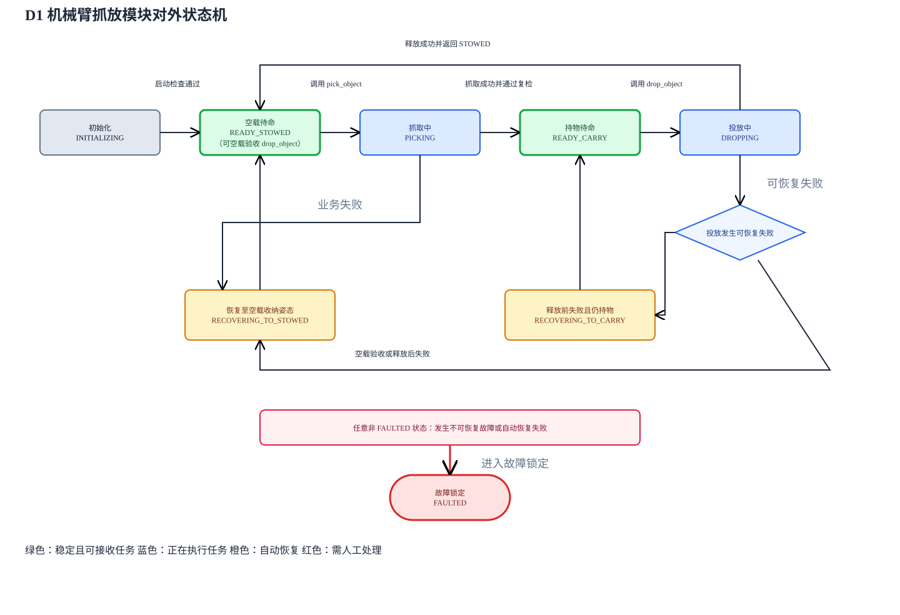

# D1 机械臂抓放 API 文档

# 第一部分：接口使用指南

本部分包含调用方正确使用机械臂抓放模块所需了解的全部内容，包括公共状态机、调用方法和结果处理规则。

## 1. 模块与接口概览

机械臂抓放模块对外提供两个任务 Action 接口和一个状态 Topic。调用方只需提供目标的大致位置并处理任务结果，不需要指定物体类别、抓取姿态、释放姿态或机械臂轨迹。

| 名称 | 类型 | ROS 2 类型 | 用途 |
| --- | --- | --- | --- |
| `/arm/tasks/pick_object` | Action | `d1_interfaces/action/PickObject` | 根据物体粗略位置完成识别、抓取、抬升和携带 |
| `/arm/tasks/drop_object` | Action | `d1_interfaces/action/DropObject` | 根据垃圾桶底部中心完成投放并返回 STOWED |
| `/arm/task_status` | Topic | `d1_interfaces/msg/ArmTaskStatus` | 发布机械臂当前业务状态、载荷状态、执行阶段和故障信息 |

正常捡拾任务只包含以下两个调用：

| 当前状态 | 调用接口 | 调用方提供 | 成功后的状态 |
| --- | --- | --- | --- |
| `READY_STOWED` | `pick_object` | 待抓物体的粗略位置 | `READY_CARRY`，机械臂已确认持物 |
| `READY_CARRY` | `drop_object` | 垃圾桶底部中心 | `READY_STOWED`，物体已释放 |

机械臂抓放模块负责：

- 从 `yellow_cube`、`zucchini`、`bowl` 中自动识别物体；
- 计算并执行抓取、携带、释放和恢复动作；
- 对可恢复的业务失败自动回到稳定姿态；
- 通过 Action Result 告诉调用方下一步应继续、调整机器人载体、换投放点还是停止任务。

调用方负责：

- 提供物体粗略位置或垃圾桶底部中心；
- 在发起任务前检查 `/arm/task_status`；
- 根据 Result 中的 `outcome` 做下一步决策；
- 遇到 `ARM_FAULTED` 时停止自动任务并转人工处理。

本文是上述公共接口的外部契约。感知、MoveIt、调试接口和内部状态迁移接口不属于公共 API。调用方只需依赖 `d1_interfaces`，并与机械臂抓放模块使用相同的 `ROS_DOMAIN_ID`。

## 2. 对外状态机

`/arm/task_status` 会发布以下完整业务状态。它们属于公共接口，调用方应根据当前状态决定是否发送任务。

| 值 | 状态 | 含义 | 调用方行为 |
| --- | --- | --- | --- |
| `0` | `INITIALIZING` | 模块正在检查反馈、标准姿态和规划场景 | 等待，不发送任务 |
| `1` | `READY_STOWED` | 机械臂空载并处于 STOWED | 可调用 `pick_object`；也可空载调用 `drop_object` 进行验收 |
| `2` | `READY_CARRY` | 机械臂已确认持物并处于 CARRY | 可调用 `drop_object` |
| `3` | `PICKING` | 正在执行抓取 | 等待，不发送新任务 |
| `4` | `DROPPING` | 正在执行投放 | 等待，不发送新任务 |
| `5` | `RECOVERING_TO_STOWED` | 正在自动恢复至空载 STOWED | 等待恢复完成 |
| `6` | `RECOVERING_TO_CARRY` | 正在保留载荷并恢复至 CARRY | 等待恢复完成 |
| `7` | `FAULTED` | 出现无法自动处理的执行、通信或状态故障 | 停止自动任务并人工排障 |

主要状态转移如下：



该图的可编辑源文件为 [arm_task_state_machine.drawio](assets/diagrams/arm_task_state_machine.drawio)。任意非 `FAULTED` 状态发生不可恢复故障或自动恢复失败时，都会进入 `FAULTED`。

`PICKING`、`DROPPING` 和两个 `RECOVERING_*` 是调用方能够观察到的业务状态，但不要求调用方理解任务内部正在执行的具体动作。`PREPARE_GRASP`、`MOVE_PREGRASP` 等内部阶段仅用于进度显示和排障，统一列在第二部分。

## 3. 快速调用

以下命令假设已经加载 ROS 2 环境，并将 `ROS_DOMAIN_ID` 设置为与机械臂抓放模块相同的值。

### 3.1 确认模块与接口就绪

先确认两个 Action 和状态 Topic 均已发现：

```bash
ros2 action list | grep '^/arm/tasks/'
ros2 topic list | grep '^/arm/task_status$'
```

正常应包含：

```text
/arm/tasks/drop_object
/arm/tasks/pick_object
/arm/task_status
```

然后读取机械臂当前状态：

```bash
ros2 topic echo /arm/task_status --once
```

开始正常抓取前应看到 `state: 1`（`READY_STOWED`）和 `payload_state: 0`（`PAYLOAD_EMPTY`）。仅发现 Action Server 不代表机械臂已经可以接收任务。

### 3.2 调用抓取

`pick_object` 接收待抓物体的**粗略位置**。调用方不需要传物体类别，机械臂会在观测阶段自动识别并计算精确抓取位姿。

```bash
ros2 action send_goal /arm/tasks/pick_object \
  d1_interfaces/action/PickObject \
  "{target: {header: {frame_id: base_link}, point: {x: 0.20, y: 0.35, z: -0.15}}, stop_after: 4}" \
  --feedback
```

示例坐标只用于说明消息格式，实际调用必须替换为现场估计值。生产调用固定使用 `stop_after: 4`。

抓取成功时，Result 的核心内容为：

```yaml
success: true
outcome: 0                 # OUTCOME_SUCCESS
final_task_state: 2        # READY_CARRY
payload_state: 1           # PAYLOAD_HELD
class_name: yellow_cube
```

此时调用方可以让机器人载体导航至垃圾桶附近，再调用 `drop_object`。

### 3.3 调用投放

`drop_object` 接收的是**垃圾桶底部中心**，不是桶沿、所抓物体中心或 TCP 释放位置。

```bash
ros2 action send_goal /arm/tasks/drop_object \
  d1_interfaces/action/DropObject \
  "{target: {header: {frame_id: base_link}, point: {x: 0.00, y: 0.40, z: -0.28}}}" \
  --feedback
```

投放成功时，Result 的核心内容为：

```yaml
success: true
outcome: 0                 # OUTCOME_SUCCESS
returned_to_stowed: true
final_task_state: 1        # READY_STOWED
payload_state: 0           # PAYLOAD_EMPTY
```

此时机械臂已经释放物体并返回 STOWED，可以开始下一项任务。

### 3.4 持续查看状态

调试时可持续输出全局状态：

```bash
ros2 topic echo /arm/task_status
```

Action Feedback 描述本次任务正在执行到哪个阶段；Action Result 描述该次调用最终怎样结束；`/arm/task_status` 描述机械臂此刻的全局状态。客户端超时、断线或 Goal 被拒绝时，应查询 `/arm/task_status`，不能直接重发任务。

## 4. 如何处理返回结果

### 4.1 首先读取 `outcome`

调用方应以 Action Result 中的 `outcome` 决定下一步。`failure_category`、`failed_state` 和 `detail` 用于记录与诊断，不应替代 `outcome` 参与业务分支。

#### `pick_object` 决策表

| `outcome` | 机械臂预期状态 | 调用方应执行的动作 |
| --- | --- | --- |
| `OUTCOME_SUCCESS(0)` | `READY_CARRY / PAYLOAD_HELD` | 导航到垃圾桶附近并调用 `drop_object` |
| `OUTCOME_REPOSITION_REQUIRED(1)` | `READY_STOWED / PAYLOAD_EMPTY` | 调整机器人载体的位置或视角，等待 `READY_STOWED` 后重新抓取 |
| `OUTCOME_ARM_FAULTED(2)` | `FAULTED / PAYLOAD_UNKNOWN` | 停止自动任务并人工排障 |

#### `drop_object` 决策表

| `outcome` | 机械臂预期状态 | 调用方应执行的动作 |
| --- | --- | --- |
| `OUTCOME_SUCCESS(0)` | `READY_STOWED / PAYLOAD_EMPTY` | 继续下一项任务 |
| `OUTCOME_REPOSITION_REQUIRED(1)` | 携物任务通常恢复为 `READY_CARRY / PAYLOAD_HELD` | 调整机器人载体与垃圾桶的相对位置后重试 |
| `OUTCOME_ARM_FAULTED(2)` | `FAULTED / PAYLOAD_UNKNOWN` | 停止自动任务并人工排障 |
| `OUTCOME_NEW_TARGET_REQUIRED(3)` | 保持或恢复调用前稳定状态 | 重新估计或指定垃圾桶底部中心；不要原样重发 |

### 4.2 Result 核心字段

两个 Action 的 Result 均提供以下核心字段：

| 字段 | 调用方用途 |
| --- | --- |
| `success` | 快速判断完整业务是否成功；程序决策仍应以 `outcome` 为准 |
| `outcome` | 面向调用方的下一步决策码 |
| `returned_to_stowed` | 返回 Result 时是否已经确认回到 STOWED |
| `final_task_state` | 返回 Result 时的机械臂任务状态 |
| `payload_state` | 返回 Result 时是否确认持有物体 |

调用方应校验 Result 中的 `final_task_state/payload_state` 与最新 `/arm/task_status`。两者不一致时不得继续自动任务，应按状态同步故障处理。`failure_category`、`failed_state`、`detail` 等诊断字段见第二部分。

### 4.3 并发、超时和重试

- 同一时间只允许执行一个 `pick_object` 或 `drop_object`；
- 客户端等待超时不代表机械臂没有执行，应先查询 `/arm/task_status`，禁止直接重发；
- 收到 `REPOSITION_REQUIRED` 或 `NEW_TARGET_REQUIRED` 后，应等待机械臂进入对应稳定状态再发送新请求；
- 收到 `ARM_FAULTED` 或状态变为 `FAULTED` 后，不得继续调用抓放接口；
- 软件取消不能替代物理急停或断电措施。

### 4.4 坐标约定

两个 Action 的目标均使用 `geometry_msgs/PointStamped`：

```text
std_msgs/Header header
  builtin_interfaces/Time stamp
  string frame_id
geometry_msgs/Point point
  float64 x
  float64 y
  float64 z
```

- `frame_id` 必填，且必须存在到机械臂规划坐标系的 TF；
- `x/y/z` 单位为米，且必须是有限数值；
- 推荐使用机器人载体基座坐标系或机械臂 `base_link`；
- `stamp=0` 表示使用最新 TF；`pick_object` 支持在观测阶段查询非零时间戳对应的 TF，当前 `drop_object` 始终使用最新 TF；
- `pick_object.target` 与 `drop_object.target` 的业务含义不同，不能混用。

# 第二部分：补充参考信息

本部分用于接口客户端开发、完整消息查询、日志分析和异常排查。普通调用方无需阅读或理解本部分，也不影响正确调用抓取、投放和状态接口；遇到异常或需要使用诊断字段时再按需查询即可。

## A. `pick_object` 完整接口参考

### A.1 基本信息

| 项目 | 内容 |
| --- | --- |
| Action 名称 | `/arm/tasks/pick_object` |
| Action 类型 | `d1_interfaces/action/PickObject` |
| 生产调用前置状态 | `READY_STOWED` |
| 成功后状态 | `READY_CARRY` |
| 成功后载荷状态 | `PAYLOAD_HELD` |
| 支持类别 | `yellow_cube`、`zucchini`、`bowl` |

调用方不传物体类别。`target` 是物体的大致位置提示，机械臂移动到观测姿态后会在允许类别中自动识别目标，并重新估计精确抓取位姿。

### A.2 请求参数

```text
uint8 COMPUTE_ONLY=0
uint8 MOVE_PREGRASP=1
uint8 DESCEND=2
uint8 GRASP_AND_LIFT=3
uint8 GRASP_AND_CARRY=4

geometry_msgs/PointStamped target
uint8 stop_after
```

| 字段 | 类型 | 必填 | 说明 |
| --- | --- | --- | --- |
| `target` | `geometry_msgs/PointStamped` | 是 | 调用方估计的目标物体粗略位置，用于规划观测动作和关联视觉目标 |
| `target.header.frame_id` | `string` | 是 | 目标点所属坐标系；必须存在到机械臂规划坐标系的 TF |
| `target.header.stamp` | `Time` | 否 | 零值使用最新 TF；非零值供观测阶段查询对应时刻的 TF |
| `target.point` | `Point` | 是 | 目标位置，单位为米 |
| `stop_after` | `uint8` | 是 | 生产环境必须为 `GRASP_AND_CARRY(4)` |

`COMPUTE_ONLY(0)` 至 `GRASP_AND_LIFT(3)` 是分阶段调试能力，默认生产启动不会开放。生产环境传入非 `4` 值时 Goal 会被拒绝，且不会执行机械臂动作。

### A.3 命令行调用

以下坐标仅用于展示请求格式，不能直接作为其他现场的安全抓取点：

```bash
ros2 action send_goal /arm/tasks/pick_object \
  d1_interfaces/action/PickObject \
  "{target: {header: {frame_id: base_link}, point: {x: 0.20, y: 0.35, z: -0.15}}, stop_after: 4}" \
  --feedback
```

使用机器人载体坐标系时，将 `frame_id` 改为实际基座 frame，并传入该坐标系下的目标点。机械臂抓放模块必须能够查询该 frame 到 `base_link` 的 TF。

### A.4 执行反馈与内部阶段

```text
string current_state
float32 progress
string detail
```

| 字段 | 说明 |
| --- | --- |
| `current_state` | 当前抓取阶段 |
| `progress` | 名义流程进度，范围 `0.0~1.0`；不表示剩余时间 |
| `detail` | 当前阶段的人类可读说明 |

生产抓取可能依次出现以下阶段：

| `current_state` | 含义 |
| --- | --- |
| `ENSURE_STOWED` | 检查或恢复到标准 STOWED 姿态 |
| `PLAN_OBSERVE` / `MOVE_OBSERVE` | 规划并执行粗观测动作 |
| `CLASSIFY_TARGET` | 从支持类别中识别目标 |
| `PREPARE_GRASP` | 精观测并计算物体专用抓取方案 |
| `MOVE_PREGRASP` | 移动到预抓取姿态 |
| `FINETUNE_GRASP` | 使用腕部 RGB-D 将目标调整到标定安全区 |
| `PRECHECK_ESCAPE` | 在闭合夹爪前验证携物 LIFT 和 CARRY 退路 |
| `DESCEND` | 保持物体专用姿态下降 |
| `GRASP` | 闭合夹爪 |
| `ATTACH_OBJECT` | 将感知估计的物体加入 MoveIt 附着碰撞模型 |
| `LIFT` | 从物体附近抬升 |
| `CARRY` | 移动到携带姿态 |
| `VERIFY_GRASP` | 根据 Joint6 反馈验证物体是否仍被夹持 |
| `RECOVERING_TO_STOWED` | 抓取未保持或业务失败后返回 STOWED |

### A.5 返回参数

```text
bool success
uint8 outcome
uint8 failure_category
string failed_state
string detail
bool returned_to_stowed
uint8 final_task_state
uint8 payload_state
string class_name
geometry_msgs/PointStamped estimated_center
geometry_msgs/PoseStamped grasp_pose
geometry_msgs/PoseStamped pregrasp_pose
float64 pregrasp_distance_m
float64 grasp_distance_m
float64 grasp_yaw_degrees
float64 approach_tilt_degrees
```

| 字段 | 类型 | 取值或有效条件 | 说明 |
| --- | --- | --- | --- |
| `success` | `bool` | `true` / `false` | 是否完成完整抓取、进入 CARRY 并通过夹持复检 |
| `outcome` | `uint8` | `0 OUTCOME_SUCCESS`：抓取成功<br>`1 OUTCOME_REPOSITION_REQUIRED`：需要调整机器人载体<br>`2 OUTCOME_ARM_FAULTED`：机械臂故障 | 面向调用方的最终决策码，必须优先处理；具体处理方式见第一部分 4.1 |
| `failure_category` | `uint8` | `0 FAILURE_NONE`：无失败<br>`1 FAILURE_INCOMPLETE_INFORMATION`：视觉、深度、TF、重力或状态信息不足<br>`2 FAILURE_THEORETICALLY_INFEASIBLE`：抓取策略或理论候选不可行<br>`3 FAILURE_EXECUTION_ERROR`：规划执行、控制器、通信、取消、恢复或内部错误<br>`4 FAILURE_REPOSITION_REQUIRED`：当前相对位置无安全可达方案<br>`5 FAILURE_GRASP_NOT_SECURED`：CARRY 复检确认物体未可靠保持 | 用于统计和诊断，不能替代 `outcome` 决定是否重试 |
| `failed_state` | `string` | 成功时通常为空 | 首次确定失败的内部阶段，仅用于诊断 |
| `detail` | `string` | 自由文本 | 详细原因、恢复结果和建议；可能随实现更新，不得用于程序分支 |
| `returned_to_stowed` | `bool` | `true` / `false` | 返回结果时是否已确认处于 STOWED |
| `final_task_state` | `uint8` | 与 `/arm/task_status.state` 相同 | 返回结果时的任务状态 |
| `payload_state` | `uint8` | 与 `/arm/task_status.payload_state` 相同 | 返回结果时的载荷状态 |
| `class_name` | `string` | `yellow_cube`、`zucchini`、`bowl`；识别前失败时可能为空 | 自动识别出的类别名称 |
| `estimated_center` | `PointStamped` | 成功时有效 | 精观测或微调后的物体中心估计 |
| `grasp_pose` | `PoseStamped` | 成功时有效 | 最终选中的 TCP 抓取位姿 |
| `pregrasp_pose` | `PoseStamped` | 成功时有效 | 最终选中的 TCP 预抓取位姿 |
| `pregrasp_distance_m` | `float64` | 成功时有效，单位为米 | 物体策略选中的预抓取距离或离地间隙 |
| `grasp_distance_m` | `float64` | 成功时有效，单位为米 | 物体策略选中的抓取深度或离地间隙 |
| `grasp_yaw_degrees` | `float64` | 成功时有效，单位为度 | 最终抓取 yaw |
| `approach_tilt_degrees` | `float64` | 成功时有效，单位为度；当前生产策略通常为 `0` | 最终 approach 倾角 |

位姿、距离和识别字段只应在 `success=true` 时作为可靠结果使用。调用方不应根据这些诊断字段自行复现机械臂轨迹。同一 `failure_category` 可能因恢复是否成功而得到不同 `outcome`，因此不能只根据技术分类决定是否重试。

### A.6 返回示例

成功时的核心字段：

```yaml
success: true
outcome: 0                 # OUTCOME_SUCCESS
failure_category: 0        # FAILURE_NONE
failed_state: ""
returned_to_stowed: false
final_task_state: 2        # READY_CARRY
payload_state: 1           # PAYLOAD_HELD
class_name: yellow_cube
detail: yellow_cube grasped, carried and mechanically verified: ...
```

需要调整机器人载体时：

```yaml
success: false
outcome: 1                 # OUTCOME_REPOSITION_REQUIRED
failure_category: 4        # FAILURE_REPOSITION_REQUIRED
failed_state: PLAN_PREGRASP
returned_to_stowed: true
final_task_state: 1        # READY_STOWED
payload_state: 0           # PAYLOAD_EMPTY
detail: no cube pregrasp has a feasible downstream grasp; ...
```

## B. `drop_object` 完整接口参考

### B.1 基本信息

| 项目 | 内容 |
| --- | --- |
| Action 名称 | `/arm/tasks/drop_object` |
| Action 类型 | `d1_interfaces/action/DropObject` |
| 正常任务前置状态 | `READY_CARRY` |
| 空载验收前置状态 | `READY_STOWED` |
| 成功后状态 | `READY_STOWED` |
| 成功后载荷状态 | `PAYLOAD_EMPTY` |

`READY_STOWED` 下允许空载调用，用于部署验收；实际捡垃圾任务应在抓取成功并进入 `READY_CARRY` 后调用。

### B.2 请求参数

```text
geometry_msgs/PointStamped target
```

| 字段 | 类型 | 必填 | 说明 |
| --- | --- | --- | --- |
| `target` | `geometry_msgs/PointStamped` | 是 | 调用方估计的垃圾桶底部中心，不是桶沿、物体中心或 TCP 释放位置 |
| `target.header.frame_id` | `string` | 是 | 投放点所属坐标系；必须存在到规划坐标系的 TF |
| `target.header.stamp` | `Time` | 否 | 当前实现使用最新 TF，建议传零值 |
| `target.point` | `Point` | 是 | 垃圾桶底部中心，单位为米 |

机械臂抓放模块会根据垃圾桶底部中心和重力方向搜索 TCP 释放高度及 yaw，并预先验证去程和完全松开后的 STOWED 回程。垃圾桶中心与机械臂 `base_link` 的推荐水平距离为 `0.35~0.45 m`，该范围是导航建议，不是请求格式约束。

机器人载体平台的 XY 包络及其外扩安全区属于禁投区。目标点落入禁投区时机械臂不会运动，并返回 `OUTCOME_NEW_TARGET_REQUIRED`。该区域由部署配置中的载体平台几何建立。

### B.3 命令行调用

以下坐标只展示格式，调用前必须替换为现场估计的垃圾桶底部中心：

```bash
ros2 action send_goal /arm/tasks/drop_object \
  d1_interfaces/action/DropObject \
  "{target: {header: {frame_id: base_link}, point: {x: 0.00, y: 0.40, z: -0.28}}}" \
  --feedback
```

### B.4 执行反馈与内部阶段

```text
string current_state
float32 progress
string detail
```

| `current_state` | 含义 |
| --- | --- |
| `CHECK_PRECONDITIONS` | 检查载荷、MoveIt 起始状态、TF、重力和载体平台禁投区 |
| `PLAN_RELEASE` | 搜索同时满足去程与回程要求的释放候选 |
| `MOVE_RELEASE` | 移动到选定释放位姿 |
| `RELEASE` | 完全张开夹爪并移除附着物体 |
| `RELEASE_HOLD` | 保持夹爪完全张开 |
| `STOWED` | 执行预验证的空载回程并返回 STOWED |
| `RECOVERING_TO_STOWED` | 空载任务失败后恢复 STOWED |
| `RECOVERING_TO_CARRY` | 携物任务在释放前失败后恢复 CARRY |

`progress` 是名义流程进度，不代表剩余时间。候选搜索数量不同会导致 `PLAN_RELEASE` 耗时变化。

### B.5 返回参数

```text
bool success
uint8 outcome
uint8 failure_category
string failed_state
string detail
bool returned_to_stowed
uint8 final_task_state
uint8 payload_state
geometry_msgs/PoseStamped release_pose
float64 height_offset_m
float64 release_yaw_degrees
```

| 字段 | 类型 | 取值或有效条件 | 说明 |
| --- | --- | --- | --- |
| `success` | `bool` | `true` / `false` | 是否完成释放并确认返回 STOWED |
| `outcome` | `uint8` | `0 OUTCOME_SUCCESS`：投放成功<br>`1 OUTCOME_REPOSITION_REQUIRED`：需要调整机器人载体<br>`2 OUTCOME_ARM_FAULTED`：机械臂故障<br>`3 OUTCOME_NEW_TARGET_REQUIRED`：需要重新指定投放点 | 面向调用方的最终决策码；具体处理方式见第一部分 4.1 |
| `failure_category` | `uint8` | `0 FAILURE_NONE`：无失败<br>`1 FAILURE_INCOMPLETE_INFORMATION`：载荷、附着物体、TF、重力或规划场景信息不足/不一致<br>`2 FAILURE_THEORETICALLY_INFEASIBLE`：理论释放约束无法满足<br>`3 FAILURE_EXECUTION_ERROR`：规划执行、夹爪、控制器、通信、取消、恢复或内部错误<br>`4 FAILURE_REPOSITION_REQUIRED`：没有安全可达的释放往返方案<br>`5 FAILURE_TARGET_IN_KEEP_OUT`：目标位于载体平台禁投区 | 用于统计和诊断，不能替代 `outcome` 决定是否重试 |
| `failed_state` | `string` | 成功时通常为空 | 首次确定失败的内部阶段 |
| `detail` | `string` | 自由文本 | 详细原因、候选统计和恢复结果；不得用于程序分支 |
| `returned_to_stowed` | `bool` | `true` / `false` | 返回结果时是否确认处于 STOWED |
| `final_task_state` | `uint8` | 与 `/arm/task_status.state` 相同 | 返回结果时的任务状态 |
| `payload_state` | `uint8` | 与 `/arm/task_status.payload_state` 相同 | 返回结果时的载荷状态 |
| `release_pose` | `PoseStamped` | 成功时有效 | 实际选中的 TCP 释放位姿 |
| `height_offset_m` | `float64` | 成功时有效，单位为米 | 成功候选相对基准释放高度的偏移 |
| `release_yaw_degrees` | `float64` | 成功时有效，单位为度 | 成功候选相对参考方向的 yaw 偏移 |

`release_pose`、`height_offset_m` 和 `release_yaw_degrees` 只在 `success=true` 时有效。同一 `failure_category` 可能因恢复是否成功而得到不同 `outcome`。

### B.6 返回示例

携物投放成功：

```yaml
success: true
outcome: 0                 # OUTCOME_SUCCESS
failure_category: 0        # FAILURE_NONE
failed_state: ""
returned_to_stowed: true
final_task_state: 1        # READY_STOWED
payload_state: 0           # PAYLOAD_EMPTY
height_offset_m: 0.0
release_yaw_degrees: 0.0
detail: held object released above trash bin and arm returned to STOWED
```

投放点位于禁投区：

```yaml
success: false
outcome: 3                 # OUTCOME_NEW_TARGET_REQUIRED
failure_category: 5        # FAILURE_TARGET_IN_KEEP_OUT
failed_state: CHECK_PRECONDITIONS
detail: drop target XY=(...) lies inside the carrier platform keep-out region; submit a new drop target; ...
```

## C. `/arm/task_status` 完整接口参考

### C.1 基本信息

| 项目 | 内容 |
| --- | --- |
| Topic 名称 | `/arm/task_status` |
| 消息类型 | `d1_interfaces/msg/ArmTaskStatus` |
| QoS | Reliable、Transient Local、Keep Last 1 |
| 发布方式 | 状态变化时发布；新订阅者会立即收到最近一次状态 |

`/arm/task_status` 是保留最近值的系统状态流，不是某次 Action 的返回值。Action Result 描述单次调用的最终结果；本 Topic 描述机械臂当前的全局状态。发生断线、客户端超时或 Goal 被拒绝时，应以本 Topic 判断机械臂是否仍在执行或已经故障。

### C.2 订阅方式

```bash
ros2 topic echo /arm/task_status
```

只读取最近一次状态：

```bash
ros2 topic echo /arm/task_status --once
```

空载待命状态示例：

```yaml
state: 1                   # READY_STOWED
payload_state: 0           # PAYLOAD_EMPTY
canonical_pose: 0          # POSE_STOWED
active_operation: ''
active_phase: ''
failure_code: ''
detail: Verified canonical STOWED feedback and base planning scene; ...
```

### C.3 消息字段

```text
builtin_interfaces/Time stamp
uint8 state
uint8 payload_state
uint8 canonical_pose
string active_operation
string active_phase
string failure_code
string detail
```

| 字段 | 类型 | 取值 | 说明 |
| --- | --- | --- | --- |
| `stamp` | `Time` | ROS 2 时间戳 | 状态生成时间 |
| `state` | `uint8` | `0 INITIALIZING`<br>`1 READY_STOWED`<br>`2 READY_CARRY`<br>`3 PICKING`<br>`4 DROPPING`<br>`5 RECOVERING_TO_STOWED`<br>`6 RECOVERING_TO_CARRY`<br>`7 FAULTED` | 当前对外业务状态；含义和允许操作见第一部分第 2 节 |
| `payload_state` | `uint8` | `0 PAYLOAD_EMPTY`：确认空载<br>`1 PAYLOAD_HELD`：确认持物<br>`2 PAYLOAD_UNKNOWN`：无法可靠判断 | 当前载荷状态；为 `PAYLOAD_UNKNOWN` 时不得自行假设为空或持物 |
| `canonical_pose` | `uint8` | `0 POSE_STOWED`：标准收纳姿态<br>`1 POSE_CARRY`：标准携带姿态<br>`2 POSE_OTHER`：已知不在标准姿态<br>`3 POSE_UNKNOWN`：无法可靠判断 | 当前是否处于标准 STOWED/CARRY 姿态 |
| `active_operation` | `string` | `pick_object`、`drop_object` 或空字符串 | 当前任务；空闲时通常为空 |
| `active_phase` | `string` | 内部执行阶段或空字符串 | 当前 Action 内部阶段；仅用于进度显示和诊断 |
| `failure_code` | `string` | 正常稳定状态下为空 | 机器可记录的故障标识 |
| `detail` | `string` | 自由文本 | 当前状态、阶段或故障的详细说明；不得用于程序分支 |

启动阶段只有在收到新鲜关节反馈、确认 STOWED 并确认基础规划场景已建立后才会进入 `READY_STOWED`。若当前姿态位于配置的近 STOWED 范围内，系统可能执行一次有界启动恢复；偏差过大时不会运动并进入 `FAULTED`。

## D. ROS 2 Action 行为与异常查询

ROS 2 Action 终态与机械臂业务结果是两个层次：

| ROS 2 Action 终态 | 是否有完整 Result | 查询与处理方式 |
| --- | --- | --- |
| `SUCCEEDED` | 是 | 本次业务成功，`result.success=true` |
| `ABORTED` | 是 | 业务未完成；必须读取 `outcome` 判断机械臂已安全恢复还是进入故障 |
| `CANCELED` | 是 | 当前实现停止活动命令并进入 `FAULTED`，不会自动执行后续恢复 |
| Goal rejected | 否 | 请求格式不合法，或接收时存在并发/状态冲突；立即查询 `/arm/task_status` |

当前 `pick_object` 遇到生产任务状态冲突时，通常会接受 Goal 后返回带完整原因的 `ABORTED`；`drop_object` 的并发或状态冲突可能直接拒绝 Goal。客户端必须兼容两种表现。

## E. 接入代码依赖

| 项目 | 内容 |
| --- | --- |
| 接口包 | `d1_interfaces` |
| 通信框架 | ROS 2 Humble / DDS |
| 接口版本 | `0.1.0` |
| 坐标单位 | 米（m） |
| 角度单位 | Result 中的 yaw/tilt 为度（°），ROS Pose 姿态使用四元数 |

调用方只需编译依赖 `d1_interfaces`，不应依赖 `d1_manipulation` 内部包。

Python：

```python
from d1_interfaces.action import PickObject, DropObject
from d1_interfaces.msg import ArmTaskStatus
```

C++：

```cpp
#include "d1_interfaces/action/pick_object.hpp"
#include "d1_interfaces/action/drop_object.hpp"
#include "d1_interfaces/msg/arm_task_status.hpp"
```

`package.xml`：

```xml
<depend>d1_interfaces</depend>
```

推荐的调用顺序为：订阅并等待稳定状态、发送 Action、持续处理 Feedback、等待 Result、根据 `outcome` 决策、最后使用 `/arm/task_status` 复核全局状态。不要根据 `detail` 文本匹配业务分支；该字段用于日志和人工诊断，稳定的程序分支只应依赖枚举字段。
